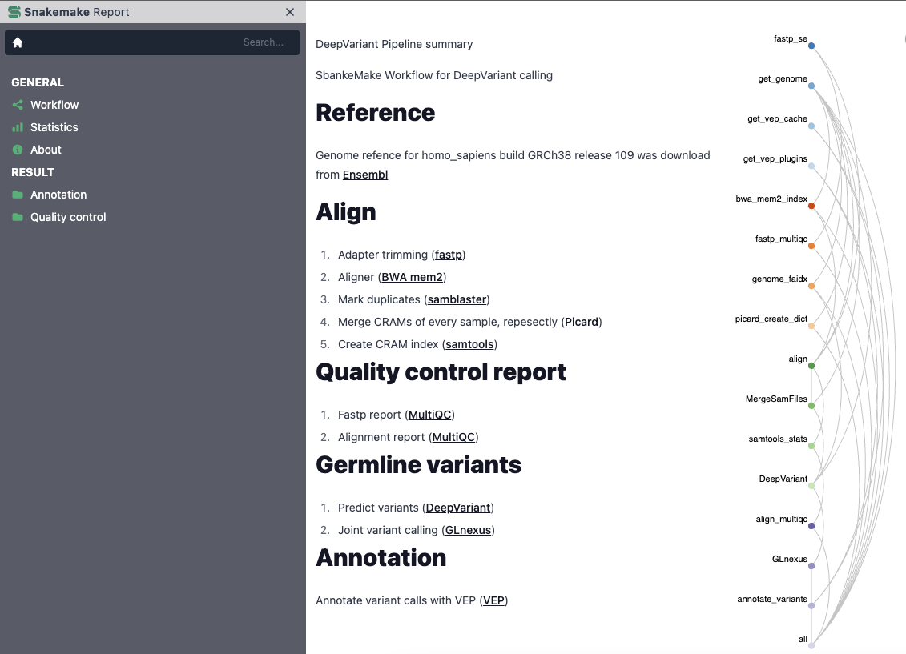
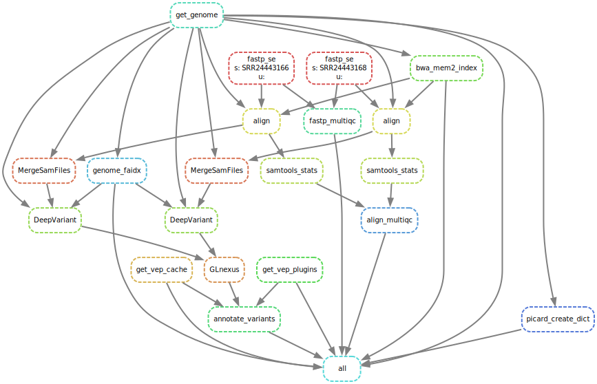

DeepVariant Pipeline summary

SnakeMake Workflow for DeepVariant calling

## Reference
Genome refence was download from Ensembl
## Align
1. Adapter trimming ([`fastp`](https://github.com/OpenGene/fastp))
2. Aligner ([`BWA mem2`](http://bio-bwa.sourceforge.net))
3. Mark duplicates ([`samblaster`](https://github.com/GregoryFaust/samblaster))
4. Merge CRAMs of every sample, repesectly ([`Picard`](https://broadinstitute.github.io/picard))
5. Create CRAM index ([`samtools`](http://www.htslib.org))
## Quality control report
1. Fastp report ([`MultiQC`](https://multiqc.info))
2. Alignment report ([`MultiQC`](https://multiqc.info))
## Germline variants
1. Predict variants ([`DeepVariant`](https://github.com/google/deepvariant))
1. Joint variant calling ([`GLnexus`](https://github.com/dnanexus-rnd/GLnexus))
## Annotation
Annotate variant calls with VEP ([`VEP`](https://www.ensembl.org/info/docs/tools/vep/index.html))
## SnakeMake Report

## Outputs
```text
├── config
│   ├── captured_regions.bed
│   ├── config.yaml
│   └── samples.tsv
├── dag.svg
├── GLnexus.DB
├── logs
├── raw
│   ├── SRR24443166.fastq.gz
│   └── SRR24443168.fastq.gz
├── README.md
├── report
│   ├── align_multiqc_data
│   ├── align_multiqc.html
│   ├── fastp_multiqc_data
│   ├── fastp_multiqc.html
│   └── vep_report.html
├── report.html
├── results
│   ├── aligned
│   ├── called
│   ├── GLnexus
│   └── vep
└── workflow
    ├── envs
    ├── report
    ├── rules
    ├── schemas
    ├── scripts
    └── Snakefile
```
## Directed Acyclic Graph
